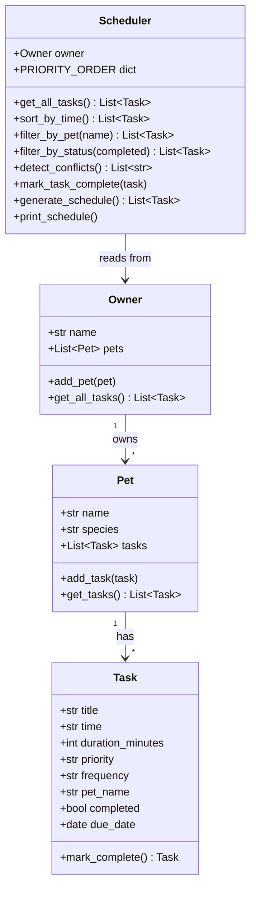

# PawPal+ (Module 2 Project)

**PawPal+** is a smart pet care management app that helps a busy owner stay consistent with pet care. It tracks daily routines — feedings, walks, medications, appointments — using a modular Python OOP backend and a Streamlit UI.

---

## Scenario

A busy pet owner needs help staying consistent with pet care. They want an assistant that can:

- Track pet care tasks (walks, feeding, meds, enrichment, grooming, etc.)
- Consider constraints (time available, priority, owner preferences)
- Produce a daily plan and explain why it chose that plan

---

## Features

### Core System (`pawpal_system.py`)

- **Owner, Pet, Task classes** — Modular OOP design using Python dataclasses
- **Sorting by time** — Tasks returned in chronological HH:MM order via `Scheduler.sort_by_time()`
- **Filtering** — Filter tasks by pet name (case-insensitive) or completion status
- **Conflict warnings** — `Scheduler.detect_conflicts()` returns a warning message when two tasks share the same scheduled time
- **Daily recurrence** — Marking a daily/weekly task complete automatically creates the next occurrence using `timedelta`
- **Smart schedule generation** — `generate_schedule()` shows only pending tasks for today, sorted by priority (high → medium → low) then time

### Smarter Scheduling

- Priority-first ordering ensures medication and feeding tasks appear before enrichment activities
- Conflict detection returns human-readable warnings instead of crashing the app
- Recurring task logic uses `datetime.timedelta` to schedule the next occurrence for daily (+1 day) and weekly (+7 days) tasks
- `due_date` on each Task prevents future recurring tasks from appearing in today's schedule

### UI (`app.py`)

- Owner and pet setup with persistent `st.session_state`
- Add tasks with title, time, duration, priority, frequency, and target pet
- Time input validation (HH:MM format enforced)
- Conflict warnings displayed via `st.warning()`
- One-click task completion that triggers recurrence logic
- Sorted task table and progress metrics in the sidebar

---

## System Architecture (UML)



---

## Getting Started

### Setup

```bash
python -m venv .venv
source .venv/bin/activate  # Windows: .venv\Scripts\activate
pip install -r requirements.txt
```

### Run the CLI demo

```bash
python main.py
```

### Run the Streamlit app

```bash
streamlit run app.py
```

---

## Testing PawPal+

### Run tests

```bash
python -m pytest
```

### What the tests cover

19 automated tests across five areas:

| Area | Tests |
|------|-------|
| Task completion & recurrence | daily, weekly, and once-off tasks |
| Pet task management | add task, get tasks |
| Sorting correctness | chronological order, empty scheduler |
| Filtering | by pet name (case-insensitive), by status |
| Conflict detection | no false positives, true positive on shared time |
| Schedule generation | excludes completed tasks, respects priority order |
| Scheduler recurrence integration | auto-adds next task for daily, not for once |

### Confidence level: ★★★★☆ (4/5)

Core logic is fully tested. Edge cases for overlapping durations and identical-priority tie-breaking remain as future work.

---

## Project Structure

```
pawpal_system.py   # Backend: Owner, Pet, Task, Scheduler classes
app.py             # Streamlit UI
main.py            # CLI demo script
tests/
  test_pawpal.py   # 19 automated pytest tests
reflection.md      # Design decisions and AI collaboration reflection
README.md          # This file
requirements.txt   # streamlit, pytest
```
