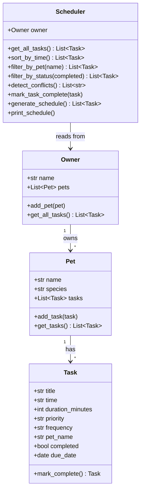

# PawPal+ Project Reflection

## 1. System Design

**a. Initial design**

I designed four core classes based on the problem domain:

- **Task** — A Python dataclass representing one pet care activity. Attributes: `title`, `time` (HH:MM), `duration_minutes`, `priority` (high/medium/low), `frequency` (daily/weekly/once), `pet_name`, `completed`, and `due_date`. Method: `mark_complete()` which returns the next Task instance for recurring tasks.
- **Pet** — A dataclass holding a pet's `name`, `species`, and a list of `tasks`. Methods: `add_task()` and `get_tasks()`.
- **Owner** — A plain class managing a list of Pet objects. Methods: `add_pet()` and `get_all_tasks()` (aggregates tasks across all pets).
- **Scheduler** — The "brain" of the system. Takes an Owner and exposes: `sort_by_time()`, `filter_by_pet()`, `filter_by_status()`, `detect_conflicts()`, `mark_task_complete()`, `generate_schedule()`, and `print_schedule()`.

Initial UML Mermaid.js diagram:

**b. Design changes**

Initially I considered making Scheduler inherit from Owner, but that would violate the Single Responsibility Principle. A scheduler organizes data — it should not own it. I switched to composition: Scheduler receives an Owner through its constructor. I also added `due_date` to Task after realizing recurring tasks need a concrete date so `generate_schedule()` can limit results to today or earlier without flooding the view with future occurrences.

---

## 2. Scheduling Logic and Tradeoffs

**a. Constraints and priorities**

The scheduler considers:
- **Priority**: high > medium > low — `generate_schedule()` sorts by priority first.
- **Time**: within the same priority tier, tasks are sorted by scheduled time (HH:MM ascending).
- **Completion status**: only pending, non-future tasks appear in today's schedule.
- **Due date**: recurring tasks auto-schedule to a future date so they don't pollute today's view.

Priority was chosen as the primary constraint because missing a high-priority task (e.g., medication) has more real-world consequences than missing a low-priority enrichment task.

**b. Tradeoffs**

Conflict detection uses exact time-string matching. This catches the most common and disruptive case — two tasks at the exact same time — but does not catch overlapping durations (e.g., a 60-minute task at 09:00 overlapping with a task at 09:30). For a basic pet care app this is a reasonable tradeoff: exact-time collisions are far more likely than duration-overlap conflicts, and the simpler logic is easier to read and test.

---

## 3. AI Collaboration

**a. How you used AI**

AI was used to:
- Brainstorm the initial class structure and generate the Mermaid.js UML skeleton.
- Generate class stubs from the UML design, saving boilerplate time.
- Suggest using Python dataclasses for `Task` and `Pet` to eliminate `__init__` verbosity.
- Draft an initial test suite, which I then reviewed and expanded to cover edge cases.
- Identify `timedelta` from `datetime` as the cleanest tool for recurring task scheduling.

The most effective prompts were specific and scoped: providing the class skeleton as context then asking one focused question, e.g. "How should `mark_task_complete` in Scheduler auto-add the next occurrence to the correct pet?"

**b. Judgment and verification**

AI initially suggested conflict detection that raised an exception when a conflict was found. I rejected this because crashing the app on a scheduling conflict is a terrible user experience — a pet owner might accidentally add two tasks at the same time and should not lose their data. I changed the method to return a list of warning strings instead, which the UI displays without interrupting the workflow. I verified this by writing `test_conflict_detected_when_same_time`, which confirms warnings are returned rather than exceptions raised.

---

## 4. Testing and Verification

**a. What you tested**

19 automated tests covering:
- Task completion (`mark_complete()` sets `completed = True`)
- Recurrence: daily tasks produce a +1 day next task; weekly tasks +7 days; one-time tasks return `None`
- Pet task count increases after `add_task()`
- Chronological sort correctness on an unsorted list
- Empty-owner edge case for sorting
- Pet-based filtering (including case-insensitivity)
- Status-based filtering (pending vs completed)
- No conflicts when all times are unique
- Conflict flagged when two tasks share a time
- Recurrence integration via `Scheduler.mark_task_complete()` (daily adds new task; once does not)
- `generate_schedule()` excludes completed tasks
- `generate_schedule()` respects priority ordering

These tests were important because the sorting, recurrence, and conflict-detection algorithms are the core "intelligence" of the app — if they're wrong, everything the user sees is wrong.

**b. Confidence**

Confidence: 4/5 stars

The core logic is well-covered. Edge cases I would test next:
- Pets with zero tasks
- Two pets with the same name
- Tasks with identical priority AND identical time (tie-breaking consistency)
- Conflict detection for overlapping durations, not just exact time matches
- Recurring tasks marked complete multiple times in sequence

---

## 5. Reflection

**a. What went well**

The CLI-first workflow was the most effective part of the process. Having `main.py` as a sandboxed demo meant I could verify that sorting, filtering, conflict detection, and recurrence all worked correctly before writing a single line of Streamlit code. This made UI debugging dramatically simpler.

**b. What you would improve**

I would add overlapping-duration conflict detection. The current implementation only catches exact time matches; a 60-minute task at 09:00 and a 30-minute task at 09:30 would not trigger a warning even though they overlap. A check using `start_time + duration_minutes` compared against all other tasks' windows would make the scheduler production-grade.

**c. Key takeaway**

AI is most valuable as a design accelerator, not a decision-maker. The UML was generated in seconds, but deciding whether Scheduler should inherit from Owner or compose it required human judgment about software design principles. The human role is to evaluate, select, and verify — not just to prompt.
